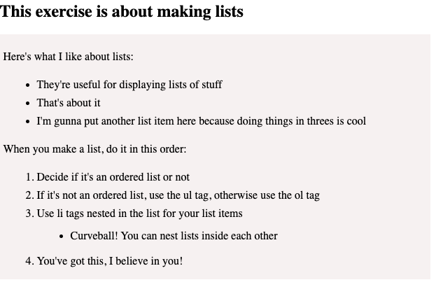
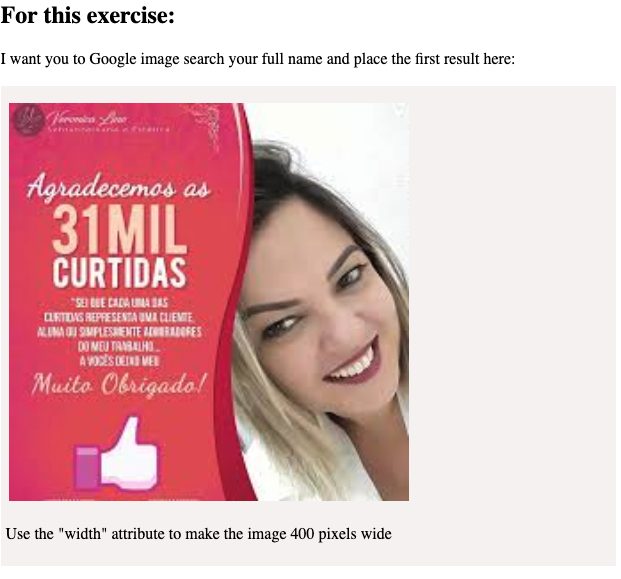

# Monday

### Week 3: HTML, CSS, CSS Units of Measurement

## Learning Objectives

After completing this lesson, you will be able to:

- Use Google Chrome’s Developer Tools
- Create tags and elements
- Write a valid HTML document
- Construct hierarchy
- Embed Images
- Create Links
- Understand how to read and write CSS
- Style HTML elements with selectors
- CSS specificity and how to use it

## Lessons

<!-----------------------------Major Topic ------------------------------------>
### [⚫ HTML](https://dc-houston.herokuapp.com/p2/HTMLCSS/HTML.html#1)

<!-----------------------------Major Topic ------------------------------------>
### [⚫ CSS](https://dc-houston.herokuapp.com/p2/HTMLCSS/CSS.html#1)

<!-----------------------------Major Topic ------------------------------------>
### [⚫ CSS Measurement Units](https://app.schoology.com/page/1643095901)

## Training Exercises

To solidify your knowledge, here are a set of exercises that will require you to use the techniques you've just learned in the lesson above.

They are organized into *small*, *medium*, and *large* sized problems. The small exercises will be very similar to the examples in the lesson. If you get stuck, refer to the relevant section above. The medium exercises will require you to combine concepts. The lesson may not have a single, specific example for you to reference. The large exercises are more open-ended and may require you to search the web for additional material.

### Small

1. 

2.

3.

4.

5.

6.

7.

8.

### Medium

1. Complete [CSS Diner](http://flukeout.github.io/)

2. Assignment - Create 90's Style Website

Create a basic website!

Start with the home page at index.html
Create pages for individual topics. These can your interest, passions, family, cats, or anything else.
Link the different pages to one another (via nav or links in the content).
Include images
Make use of tags you learned
Make use of CSS styling
Make sure all your html page are validated via plugin (or you can always [upload your HTML file here.](https://validator.w3.org/#validate_by_input))
Make 5-10 different pages. Put good content in them
 

A few ideas:

Document a few of the python projects you created with screenshots, pre-formatted code, and a brief description.
Create a hypertext version of notes you've taken during class, including links to external resources.
Create a (hopefully non-creepy) fan page for something you love.
 

Examples: https://creativemarket.com/blog/90s-web-designs

 

Though we will explore more HTML and CSS in upcoming lessons, don't be afraid to use tags and styles we haven't gone over!
- [HTML Cheatsheet](https://hostingreviewbox.com/wp-content/uploads/2016/02/html5-cheat-sheet-1.png)
- [CSS Cheatsheet](https://cdn.makeawebsitehub.com/wp-content/uploads/2016/07/css3-mega-cheat-sheet-A4.pdf)

### Submit Homework

[>>Submit Homework](https://app.schoology.com/assignment/2333761413/info)

<!-- - [>>Solutions]() -->

<!-- ## Interview Questions

### Fundamentals

Examples:

- Define a term (i.e., "ORM", "Component Lifecycle")
- Explain when a particular technology or technique is applicable

### Bugfix

Show them code and ask them what they would change to make it exhibit the correct behavior.

### Conceptual

Ask them how a technique or technology works.

### Architect

Ask them how they would build a particular feature or set of features.

## Additional Resources

URLs to external resources, such as:

- videos
- blog posts
- official docs
- useful tools -->

