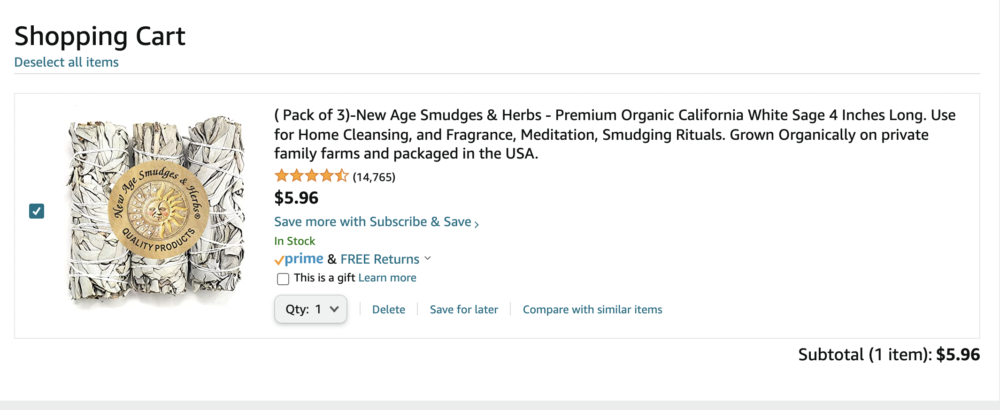
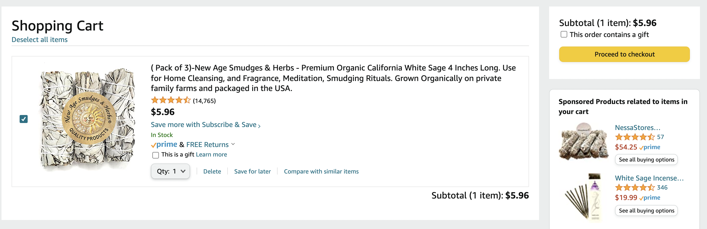
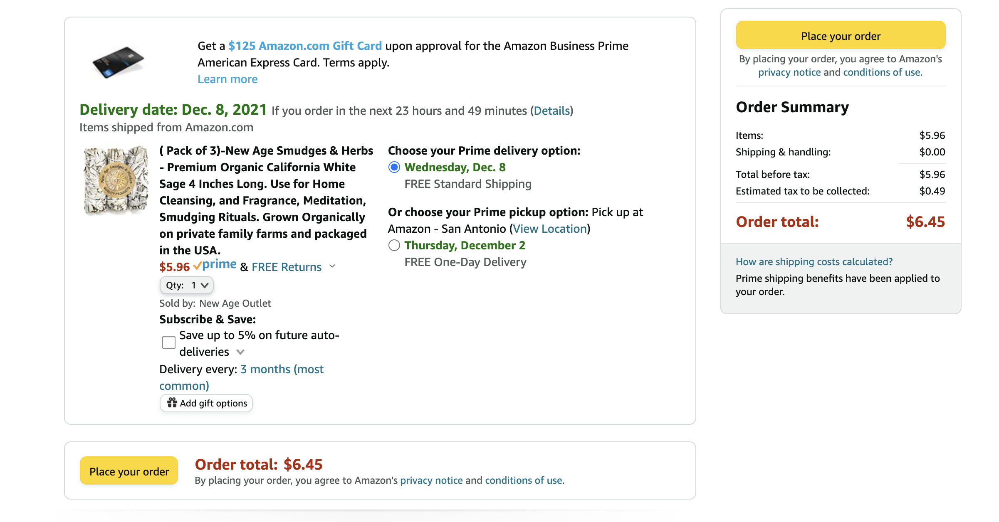

# Redux Shopping Cart

## Delete Item 
Allow user to delete an item from their cart
 
Update the following `CartItems`

- cartItems
- numberOfItems
- totalCost

## Details Page 
When a user clicks on an image or a link on the `Products` page, navigate the user a details page to show all of the details for the products.  The user should be able to add this product to the cart from this page.

- title 
- image 
- description 
- availableSizes 
- price

## Quantity for Each Item 

Allow the user to change the quantity for each item.  When a different quantity is chosen, update the following pieces of state
- cartItems 
- numberOfItems 
- totalCost

## Save Items For Later
If the user doesn't want to purchase an item right now, allow them to save the item to a "Save for later list" similar to Amazon.

## Proceed to Checkout 
Add a button to the CartItems component that says "Proceed to checkout".  Create a new page for your application. When a user clicks on the "Proceed to checkout" button, it navigates them to this page and shows a breakdown of their order, including a 8.25% sales tax. Use the image below as an example.

When the user the user click on "Place your order", It wipes out the cart and navigates to page that thanks them for their oder.

## Cart Icon

Show a small cart icon in your navigation bar that shows how many carts are in the user's cart.  This should be visible on all of the pages for the site. When a user clicks on this icon, it should navigate you to the `Proceed to Checkout` page
## Decorate the Home Page

Style the home page for your shopping cart app.
